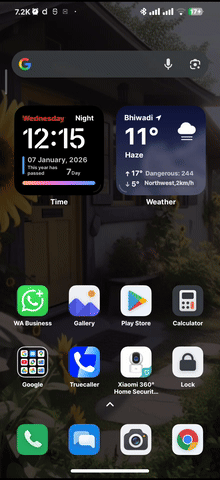
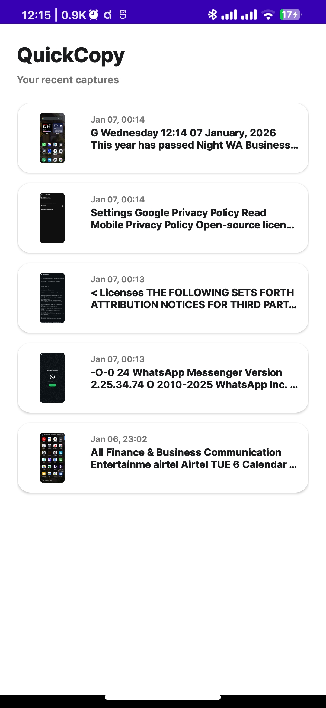
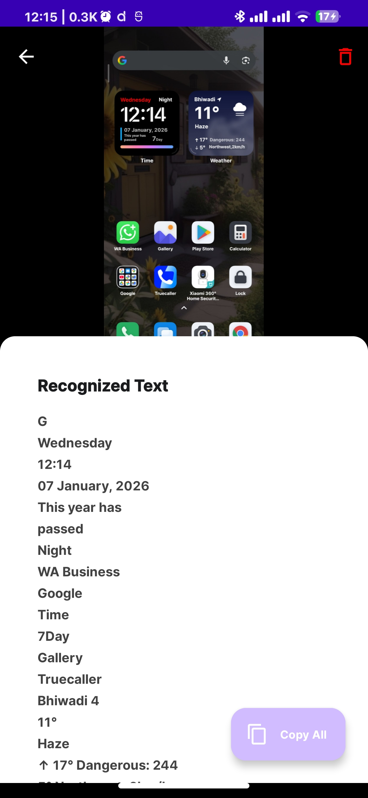

# QuickCopy 🚀

**QuickCopy** is a lightweight, performance-focused Android application designed to extract text from any screen - even from apps like Instagram or restricted PDFs that block native text selection.

Built with Native Java to leverage deep system integrations, it provides a "Zero Friction" user experience through the Android Quick Settings panel.

## 📱 Demo

  
  
  

---

## 💡 The Problem & The Solution

### **The Problem**

Many modern apps disable text selection (e.g., Instagram comments, image-heavy social feeds, or secure documents). Standard OCR apps often require you to take a screenshot manually, switch apps, upload the image, and wait for processing.

### **The Solution**

**QuickCopy** streamlines this into a single tap. By utilizing an `AccessibilityService` and a `TileService`, the app processes the current screen in the background and presents the extracted text in a non-intrusive overlay - **without ever leaving the app you are currently using.**

---

## 🛠 Architecture & Technical Deep Dive

The app follows a service-oriented architecture to ensure it can perform complex actions (like screenshotting and OCR) entirely in the background.

### **1. Core Components**

* **`MyTileService`**: Implements the `QS_TILE` API. It acts as the primary entry point, allowing users to trigger a scan from the Android Control Center. It communicates with the background service via a Broadcast Intent.
* **`MyAccessibilityService`**: The "brain" of the app. It runs as a Foreground Service to ensure high priority and prevents the service getting suspended by your OS. It listens for the trigger broadcast, collapses the notification tray using `GLOBAL_ACTION_BACK`, and captures the screen.
* **`OverlayHelper`**: Manages the `WindowManager` to draw "System Alerts". It handles the loading state and the final result dialog where the user can edit and copy the text.
* **`DatabaseHelper`**: A standard SQLite implementation that manages scan history, including image paths, OCR results, and timestamps.

### **2. The Processing Pipeline**

1. **Capture**: The app uses the `takeScreenshot` API (available in Android 11+) to retrieve a hardware-buffered bitmap of the current display.
2. **Image Optimization**: The system status bar and navigation bar heights are calculated dynamically. The bitmap is then cropped to remove these UI elements before processing.
3. **Local OCR**: Instead of cloud-based APIs, the app uses **Google ML Kit (Text Recognition)**. This ensures that processing is incredibly fast and, more importantly, **100% private/offline**.
4. **Storage**: Extracted bitmaps are saved to `context.getFilesDir()+"/scans"` and the metadata is indexed in SQLite for future reference.

---

## 🚀 Key Features

* **Background Processing**: No need to open the app; capture text from anywhere.
* **Local ML**: High-speed OCR that respects user privacy.
* **Overlay UI**: Copy text and get back to scrolling instantly.
* **History Management**: Re-visit previous scans in the app.
* **Pragmatic Stack**: Native Java implementation for maximum performance and reliability with System APIs.

---

## 📦 Tech Stack

* **Language**: Java (Android Native)
* **OCR Engine**: Google ML Kit
* **Local Storage**: SQLite
* **Image Handling**: Glide (for history thumbnails)
* **Permissions**: Accessibility Service, System Overlay, Battery Optimization

---

## ⚖️ License

This project is licensed under the **GNU General Public License v3.0 (GPLv3)**.

> "I believe in open, collaborative software. If you find this useful or build upon it, keep the chain going!"

---

## 🤝 Contributing

This was built as a hobby project to explore the limits of Android's Accessibility APIs. Feel free to fork, open issues, or submit PRs!

1. Fork the Project
2. Create your Feature Branch (`git checkout -b feature/AmazingFeature`)
3. Commit your Changes (`git commit -m 'Add some AmazingFeature'`)
4. Push to the Branch (`git push origin feature/AmazingFeature`)
5. Open a Pull Request
